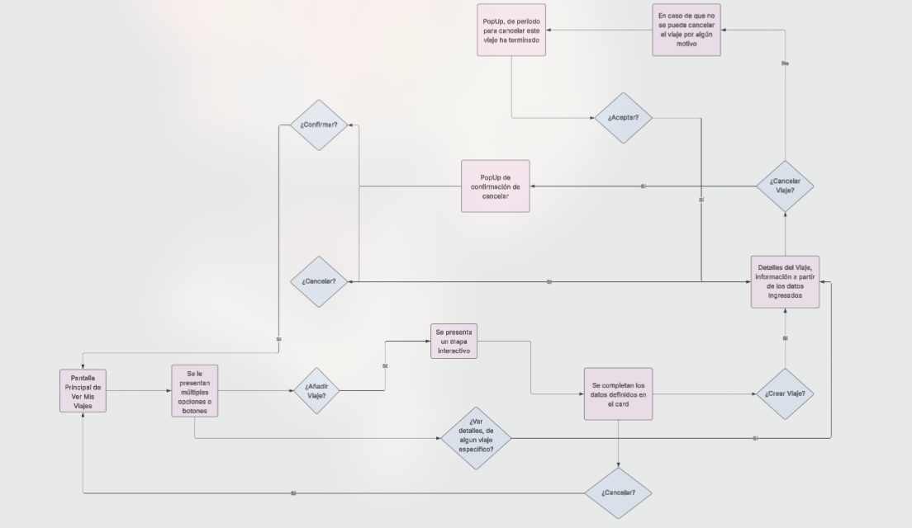
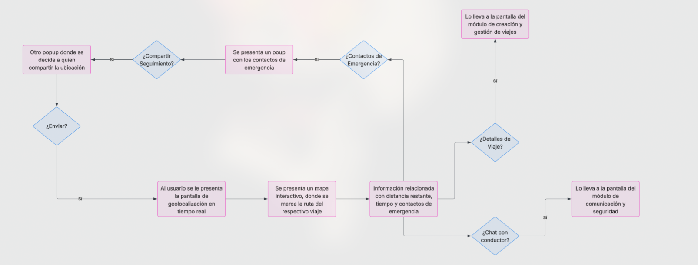
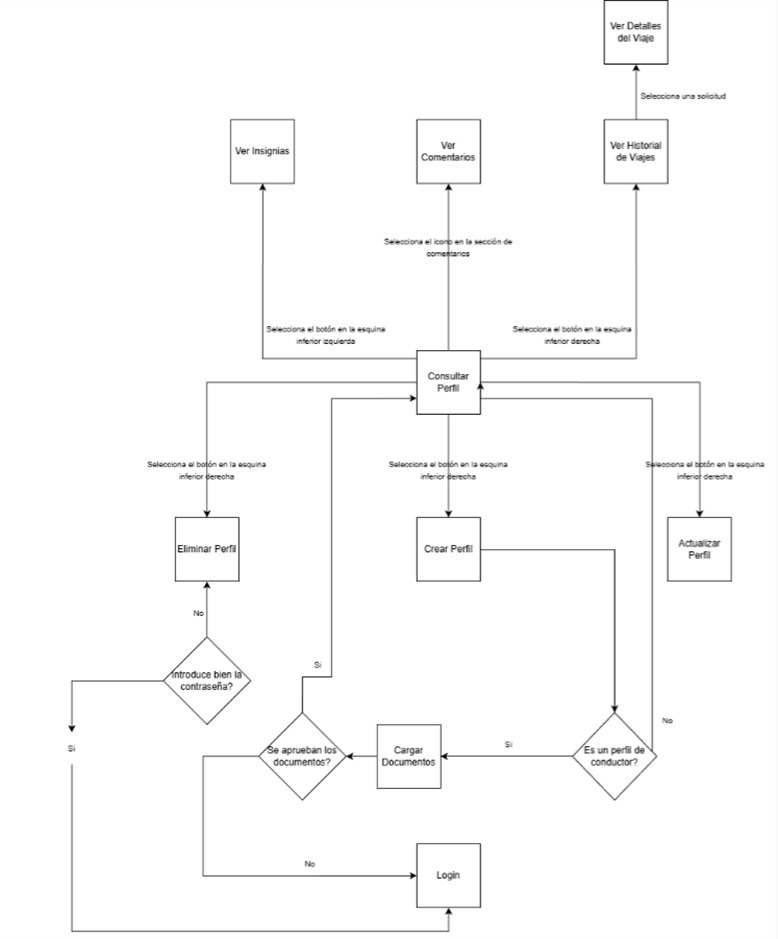
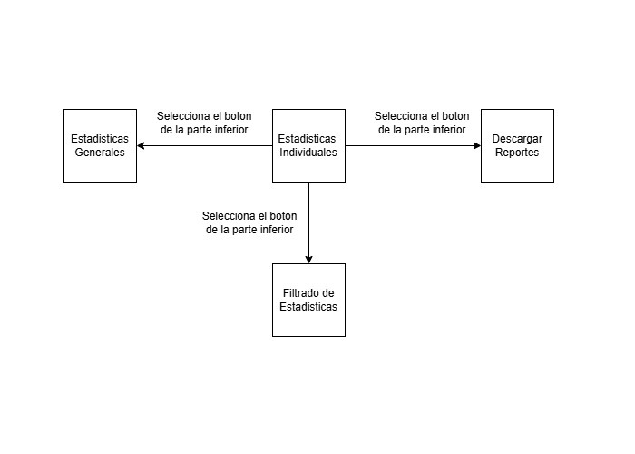
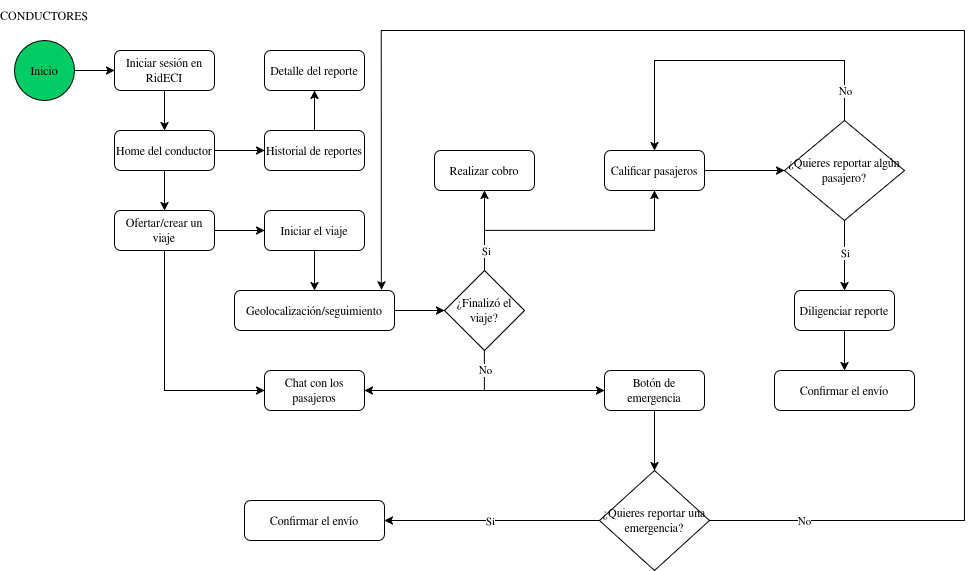
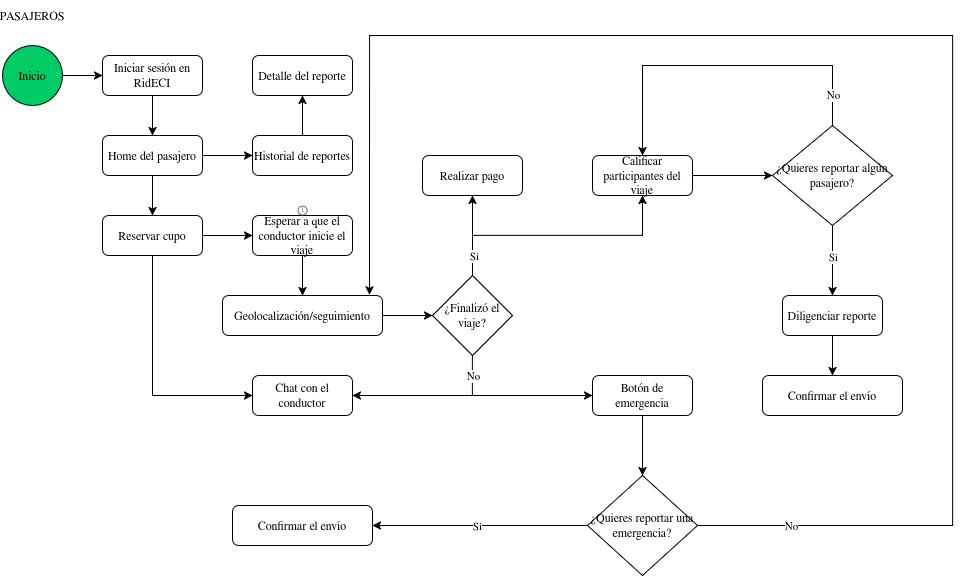
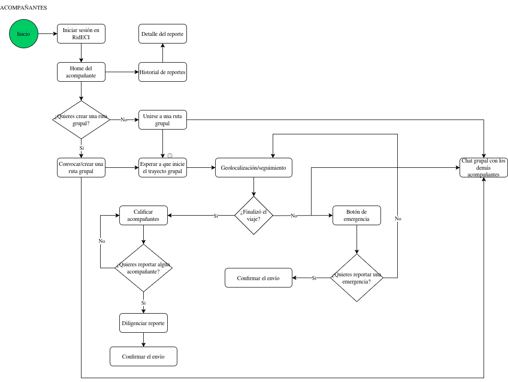
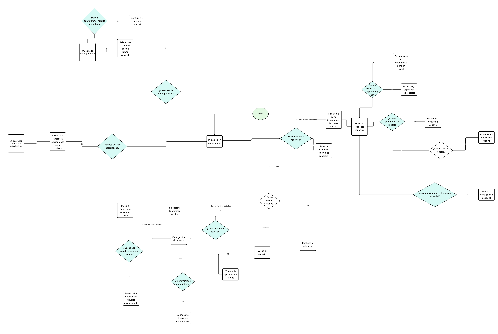

# 🚗✨ RidECI Frontend

**RidECI** is the official web platform for shared mobility at the  
**Escuela Colombiana de Ingeniería Julio Garavito**.

The frontend enables students, professors, and administrative staff to easily use the web application through an interactive interface that allows them to:

- 🔐 **Authenticate** using institutional credentials.  
- 🚘 **Browse, create, and book trips**.  
- 🗺️ **View routes in real time** through geolocation.  
- ⭐ **Rate trips** and check other users’ reputations.  
- 🚨 **Report alerts, use chat features, and access safety tools**.  
- 📊 **Access administrative dashboards and advanced statistics**.

---


## 👥 Developers

All the members of the **CVDS / DOSW 1** team.

**Participating squads:**  
- 🏛️ TROYA  
- 🌊 POSEIDON  
- ⚔️ NEMESIS  
- 🧠 ATENEA  
- 💪 KRATOS  
- 🔱 HADES  

---

## 📑 Content Table

1. [Project Architecture](#-project-architecture)
   - [Modular Per Functionality](#-modular-per-functionality-structure)
2. [Microservices Integration](#-microservices-integration)
3. [Technologies](#technologies)
4. [Branch Strategy](#-branches-strategy--structure)
5. [System Architecture & Design](#system-architecture--design)
6. [Connections with External Services](#connections-with-external-services)
7. [CI/CD Deployment](#continious-integration--continious-deployment)
8. [Demos](#functional-demos)
9. [Getting Started](#-getting-started)

## 🏛️ Project Architecture

RidECI have a unacoplated hexagonal - clean architecture where looks for isolate the business logic with the other part of the app dividing it in multiple components. 

This architecture allows:


* ✅ **Separation of Concerns:** Distinct boundaries between logic and infrastructure.
* ✅ **Maintainability:** Easier to update or replace specific components.
* ✅ **Scalability:** Components can evolve independently.
* ✅ **Testability:** The domain can be tested in isolation without a database or server.

## 📂 Modular Per Functionality Structure

This project uses a modular per functionality structure dividing the big system in modules, each one responsible of a functionality. This structure allows to organize the code and construction of components, easying the reuse of components, maintenance and project scalabilty. 


```
📂 RIDECI_FRONTEND
 ┣ 📂 public/                            # 🌐 Static public assets (favicon, manifest, etc.)
 ┃ ┗ 📄 index.html
 ┣ 📂 src/
 ┃ ┣ 📂 assets/                          # 🖼️ Images, logos, static resources
 ┃ ┣ 📂 components/
 ┃ ┃ ┗ 📂 ui/                            # 🎨 Reusable UI components
 ┃ ┣ 📂 hooks/                           # ♻️ Reusable special functions 
 ┃ ┃ ┗ 📄 use-mobile.ts                  # 📱 Detects mobile viewport usage
 ┃ ┣ 📂 lib/                             # 🧰 Utility functions, helpers, shared config
 ┃ ┣ 📂 modules/
 ┃ ┃ ┣ 📂 administration/                # 🏢 Administration module
 ┃ ┃ ┣ 📂 authentication/                # 🔐 Login, register, sessions, roles
 ┃ ┃ ┣ 📂 geolocalization/               # 📍 Location handling, maps, tracking
 ┃ ┃ ┣ 📂 payments/                      # 💳 Payment flow and transactions
 ┃ ┃ ┣ 📂 reputation and profiles/       # ⭐ User profiles and reputation system
 ┃ ┃ ┣ 📂 security/                      # 🛡️ App-wide security and permissions
 ┃ ┃ ┣ 📂 statistics and sustainability/ # 📊 Metrics, analytics, sustainability tracking
 ┃ ┃ ┣ 📂 trips/                         # 🧭 Trip creation and management
 ┃ ┃ ┗ 📂 users/                         # 👤 User management
 ┃ ┃    ┣ 📂 components/                 # 🧩 UI components specific to this module
 ┃ ┃    ┣ 📂 hooks/                      # 🔗 Custom hooks used inside the module
 ┃ ┃    ┣ 📂 pages/                      # 📄 Page-level views (routed screens)
 ┃ ┃    ┣ 📂 types/                      # 📝 TypeScript types & interfaces
 ┃ ┃    ┣ 📂 utils/                      # 🛠️ Helper functions and module utilities
 ┃ ┃    ┗ 📄 index.ts                    # 🚀 Barrel file exporting module resources
 ┃ ┣ 📄 App.tsx                          # 🧠 Root application component
 ┃ ┣ 📄 AppMainCard.tsx                  # 💳 Main card layout/UI container
 ┃ ┣ 📄 AppSidebar.tsx                   # 📚 Main sidebar navigation
 ┃ ┣ 📄 Home.tsx                         # 🏠 Home / main dashboard view
 ┃ ┣ 📄 Layout.tsx                       # 🧩 Global layout wrapper
 ┃ ┣ 📄 main.tsx                         # 🚀 Application entry point
 ┃ ┗ 📄 index.css                        # 🎨 Global styles
 ┣ 📄 .gitignore
 ┣ 📄 components.json                    # ⚙️ UI config (e.g., shadcn)
 ┣ 📄 eslint.config.js                   # 🧹 ESLint rules and configuration
 ┣ 📄 package.json                       # 📦 Project dependencies
 ┣ 📄 package-lock.json
 ┣ 📄 pnpm-lock.yaml
 ┗ 📄 README.md                          # 📘 Main documentation

```

# 🔗 Microservices Integration

The frontend does not work alone. It interacts with the RidECI Ecosystem via REST APIs, Message Brokers and API Gateway. 

These are the functionalities associated with each resposible module:

| Functionality              | Backend Module                          |
|----------------------------|------------------------------------------|
| 🔐 **Login & Verification**        | KRATOS_AUTHENTICATION_BACKEND          |
| 🚘 **Travel Management**             | NEMESIS_TRAVEL_MANAGEMENT_BACKEND      |
| 📅 **Reservations**                | POSEIDON_SEARCH_AND_BOOKING            |
| 🚨 **Alerts & Notifications**      | ATENEA_NOTIFICATIONS_BACKEND           |
| ⭐ **Profile & Reputation System**            | TROYA_REPUTATION_BACKEND               |
| 📍 **Geolocation & Tracking**      | NEMESIS_ROUTES_AND_TRACKING_BACKEND    |
| 💳 **Payments**                    | POSEIDON_PAYMENTS                      |
| 📊 **Statistics & Sustainability** | TROYA_STATISTICS_SUSTAINABILITY_BACKEND|
| 🔱 **Security & Communication**    | HADES_COMMUNICATION_SECURITY_BACKEND   |


# Technologies

The following technologies were used to build and deploy the project:

## 🚀 Frontend


## 🧩 Backend & Core


## 🗄️ Database


## 🛠️ DevOps & Infrastructure


## 🔄 CI/CD & Quality Assurance


## 📘 Documentation & Testing


## 🎨 Design


## 💬 Communication & Project Management


### ✨ Feature Branches
Used for new features or non-critical improvements.

**Format:**
`feature/[shortDescription]`

**Examples:**
- `feature/authenticationModule`
- `feature/securityService`

**Rules:**
* 🧩 **Case:** strictly *camelCase* (lowercase with hyphens).
* ✍️ **Descriptive:** Short and meaningful description.
---

# 🌿 Branches Strategy & Structure

This module follows a strict branching strategy based on Gitflow to ensure the ordered versioning,code quality and continous integration.


| **Branch**                | **Purpose**                            | **Receive of**           | **Sent to**        | **Notes**                      |
| ----------------------- | ---------------------------------------- | ----------------------- | ------------------ | ------------------------------ |
| `main`                  | 🏁 Stable code for preproduction or Production | `release/*`, `hotfix/*` | 🚀 Production      | 🔐 Protected with PR y successful CI   |
| `develop`               | 🧪 Main developing branch             | `feature/*`             | `release/*`        | 🔄 Base to continous deployment |
| `feature/*`             | ✨ New functions or refactors  to be implemented       | `develop`               | `develop`          | 🧹 Are deleted after merge to develop      |
| `release/*`             | 📦 Release preparation & final polish.      | `develop`               | `main` y `develop` | 🧪  Includes final QA. No new features added here.     |
| `bugfix/*` o `hotfix/*` | 🛠️ Critical fixes for production         | `main`                  | `main` y `develop` | ⚡ Urgent patches. Highest priority             |


# 🏷️ Naming Conventions

## 🌿 Branch Naming

### ✨ Feature Branches
Used for new features or non-critical improvements.

**Format:**
`feature/[shortDescription]`

**Examples:**
- `feature/authenticationModule`
- `feature/securityService`

**Rules:**
* 🧩 **Case:** strictly *camelCase* (lowercase with hyphens).
* ✍️ **Descriptive:** Short and meaningful description.
---

### 📦 Release Branches
Used for preparing a new production release. Follows [Semantic Versioning](https://semver.org/).

**Format:**
`release/v[major].[minor].[patch]`

**Examples:**
- `release/v1.0.0`
- `release/v1.1.0-beta`

---

### 🚑 Hotfix Branches
Used for urgent fixes in the production environment.

**Format:**
`hotfix/[shortDescription]`

**Examples:**
- `hotfix/fixTokenExpiration`
- `hotfix/securityPatch`

---

## 📝 Commit Message Guidelines

We follow the **[Conventional Commits](https://www.conventionalcommits.org/)** specification.

### 🧱 Standard Format

```text
<type>(<scope>): <short description>
```

---
## System Architecture & Design

This section provides a visual representation of the module's architecture ilustrating the base diagrams to show the application structure and components flow.

### Travel Management Screen Flow Diagram

This screen flow shows how the system will appear from the perspective of a driver or a lead escort. It illustrates trip creation and the various options that will appear if all fields are not completed, such as canceling or confirming the trip. We handle these processes. Similarly, we have the trip details screen, which displays information such as origin, destination, departure date and time, confirmed passengers, and vehicle details. Pop-ups are used appropriately in case the driver needs to take action before moving on to options in other modules.



### Geolocalization & Tracking Screen Flow Diagram

The diagram illustrates a navigation flow focused on safety and usability during a trip, where the main go-location and interactive map interface acts as a command center, adapting the experience to the user's situational needs. From this real-time data visualization, the system branches out to cover three critical scenarios: enabling emergency management through a sequence of pop-ups to share tracking information; facilitating interaction with the driver via chat, referencing the communication module; and providing trip details, referencing the trip management and creation module.



### Login & Verification Screen Flow Diagram

### Profiles & Reputation Screen Flow Diagram

This demonstrates that CRUD actions related to profiles are concentrated on the View Profile screen. From here, users can access options such as creating, updating, or deleting a profile, as well as viewing their travel history, badges, and comments associated with their reputation, all via distinct buttons. After creating or updating a profile, or reviewing reputation information (trips, comments, badges), the flow always returns to the main profile view screen, keeping the user at a clear point of reference. In contrast, when a profile is deleted, a password verification is performed to ensure security. Once the process is complete, the flow redirects the user to the login screen, indicating that their previous identity no longer exists within the system.



### Statistics & Sustainability Screen Flow Diagram

The diagram shows the navigation flow between the main screens of the Statistics and Sustainability module. From the Individual Statistics screen, the user can use the buttons at the bottom to navigate to General Statistics (swipe left), Download Reports (swipe right), or Filter Statistics (swipe down). Each arrow indicates that the screen change occurs when the corresponding button is selected at the bottom of the interface, thus illustrating how the user moves between the different functionalities of the module.


### Security & Communication Screen Flow Diagram

**Drivers**

For drivers, the first step (and obviously) is to log in with their credentials to access the features based on their role. Once inside the platform, drivers can offer a trip from the homepage to begin receiving bookings from passengers looking to join the trip.
After creating the trip and ensuring it has at least one booking, the driver can communicate with the passenger(s) via chat to coordinate the journey (note that the chat will be available until the trip is complete).
Additionally, once the trip begins, the driver can access the emergency button from the geolocation screens, and an automatic deviation alert will also be enabled.
Finally, at the end of the route, drivers can rate the passengers and, if they deem it necessary, submit a report for any incidents or inappropriate behavior during the trip.



**Passengers**

As
we specified previously in the flowcharts, access to
functionalities by role is similar in some aspects. Thus,
passenger users will also need to log in
to the platform using their credentials.

Subsequently,
they will seek to reserve a spot on one of the available trips already
created by the drivers so that (in a process similar to the previous one) these passengers can access the chat corresponding to the
route to communicate with the driver.

Likewise, when the trip begins, passengers can access the chat from the geolocation screens and press the
emergency button when necessary.

Of course, an automatic alert is enabled in case the driver
deviates from the route, and when the trip ends, passengers can rate their
driver and the other passengers; if they need to fill out a report,
they can also do so.




**Companions**


Again, a situation similar to the two explained previously. The accompanying user logs into the system and decides whether to create or join a
group route.

Regardless of the action they take, the companion will have access to a group chat to plan the
trip with the other members. Similarly to the previous cases, they have access to the emergency button, automatic alerts for
deviations, and, at the end of the trip, the rating and reporting system
corresponding to each of the other individuals.




### Institutional administration Flow Diagram

This section is accessed by logging into the admin account and features a main screen where you can review metrics, validate or reject drivers, and review reports to take action based on their severity.

Next, there's the user screen, where you can also validate or reject drivers, suspend accounts or profiles, reactivate accounts, and view user details.

We also have general application statistics.

The admin has a reports screen where they can take action by suspending the account or profile depending on the severity of the issue. They can also export these reports to Excel or PDF for archiving.

Finally, there's the settings screen where you can set driver schedules and enable or disable notifications.




## Continious Integration & Continious Deployment

In this section, we will address the deployment and continuous integration of the frontend where we can see the workflow in pre-production and production.


## Functional Demos

This section provides a visual demostration of how the web application will work showcasing the design, features and functionality.


🔐 **Login & Verification (Kratos team)**

[Login / Verification Demo](https://www.youtube.com/watch?v=scejVd_51_g&feature=youtu.be)

🚘 **Travel Management (Nemesis team)**

[Travel Management Demo](./docs/TravelManagementDemo.mkv)

🚨 **Alerts & Notifications (Atenea Team)**	

[Aminnistrator Panel & Notifications Demo](./docs/AdminPanel&NotificationsDemo.mp4)

⭐ **Profiles & Reputation System (Troya Team)**	

[Reputation System Demo](./docs/LoginDemo.mp4)

📍 **Geolocation & Tracking (Nemesis Team)**	

[Geolocation & Tracking Demo](./docs/GeolocationDemo.mkv)

💳/📅 **Payments & Reservations (Poseidon Team)**	

[Payments & Reservations Demo](https://pruebacorreoescuelaingeduco-my.sharepoint.com/:v:/g/personal/diego_chavarro-c_mail_escuelaing_edu_co/IQAADs9cQSL6RJBR08XMuN_bAZ9f4QnSJclED1cqeys2tFg?e=qypmHz&nav=eyJyZWZlcnJhbEluZm8iOnsicmVmZXJyYWxBcHAiOiJTdHJlYW1XZWJBcHAiLCJyZWZlcnJhbFZpZXciOiJTaGFyZURpYWxvZy1MaW5rIiwicmVmZXJyYWxBcHBQbGF0Zm9ybSI6IldlYiIsInJlZmVycmFsTW9kZSI6InZpZXcifX0%3D)

📊 **Statistics & Sustainability (Troya Team)**	

[Reputation System Demo](./docs/StadisticsDemo.mp4)

🔱 **Security & Communication (Hades Team)**

[Security & Communication Demo](https://www.youtube.com/watch?v=UqgRkfsuWv8)


---

# 👾 WEBSOCKET

https://www.youtube.com/watch?v=YdA5qlW7NCg


## 🚀 Getting Started

This section guides you through setting up the project locally. This project requires **Node.js**, please ensure you have it installed on your system before running the project commands. 

### Clone & open repository

``` bash
git clone https://github.com/RIDECI/RIDECI_FRONTEND.git
```

``` bash
cd RIDECI_FRONTEND
```

You can open it on your favorite IDE

### Install dependencies

Download dependencies before compile the source code

``` bash
npm install
```

### Run the project locally

To run the project locally enter the following command

``` bash
npm run dev
```
